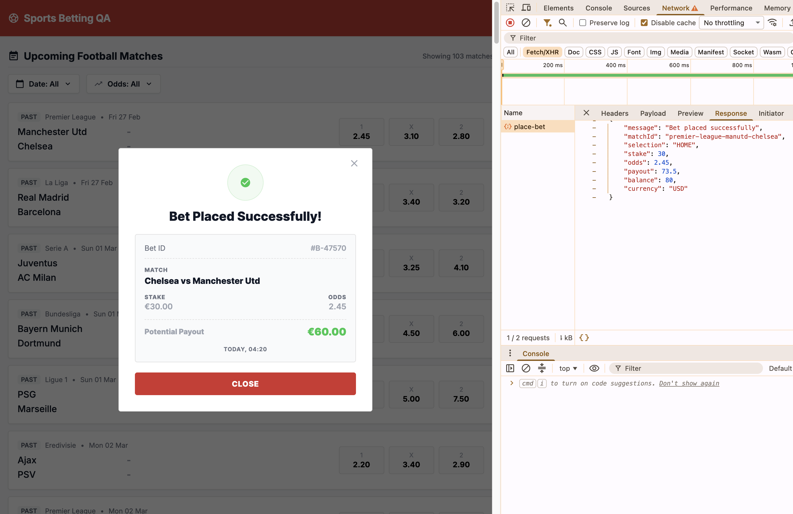

# Bug ID: API-008 - Bet Placement Accepted on an Already-Completed Match

* **Severity:** Critical
* **Reproduction Steps:**
  1. Place a bet directly via `POST /api/place-bet` on a match whose kickoff is already in the past (a completed match).
  2. Observe the server responds `200` and accepts the wager.
* **Expected Result:**
  The backend rejects placement on a match that has already started or finished, returning a lifecycle error (`409`/`422`). Client state (stale page, old match list) must not matter - the server enforces match status.

* **Actual Result:**
  The API **accepts the bet** on a completed match. No start-time/status check exists server-side.
  Also reachable via the UI: the match list renders past matches as bettable (see [UI-001](../ui/UI-001_past_matches_shown.md)). A stale page may still show a finished match, but the backend must reject the bet anyway.

* **Business Impact:**
  Users can place bets on matches that already have a result. Worsened by [UI-001](../ui/UI-001_past_matches_shown.md), which surfaces completed matches in the list.
* **Evidence:**
  Screenshot below shows successful placement on a completed match. See [UI-001](../ui/UI-001_past_matches_shown.md) (past matches shown in the UI) and [SPEC-005](../../specs/SPEC-005_bet_in_progress_409_undefined.md) (in-progress/lifecycle undefined).

