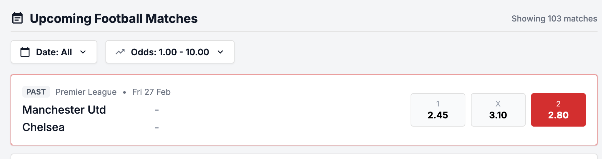

# Bug ID: UI-001 - Match List Shows Past Matches (API Returns Old Data and UI Renders It)

* **Severity:** High (becomes Critical with [API-008](../api/API-008_bet_on_completed_match.md), which accepts the bet; without that API bug this would stay a UX/data issue)
* **Reproduction Steps:**
  1. Open the application.
  2. Observe the Matches List without applying any date filter.
  3. Inspect the kickoff dates of the rendered rows against the current date (`e.g. 2026-07-10`).
  4. (API side) Call `GET /api/matches` and inspect the returned `kickoffDate` values.
* **Expected Result:**
  Per Spec Section 2.1 ("Match List") the screen must **display upcoming football matches** - only matches whose kickoff is in the future should be returned by the API and shown by the UI.
* **Actual Result:**
  The defect spans both layers:
  * **API:** `GET /api/matches` returns past/old matches in the payload (e.g. `2026-02-27`, `2026-03-01`), not just upcoming ones.
  * **UI:** The match list renders those past matches as live, bettable selections instead of filtering them out.
* **Business Impact:**
  Users can place bets on matches that have already finished - and [API-008](../api/API-008_bet_on_completed_match.md) accepts them. Risk of disputes and financial loss.
* **Evidence:**
  Screenshot below shows past kickoff dates in the list. API payload: (attachments/UI-001-past-matches-payload.json). See [SPEC-002](../specs/SPEC-002_kickoff_datetime_vs_date.md) and [API-008](../api/API-008_bet_on_completed_match.md).
 
