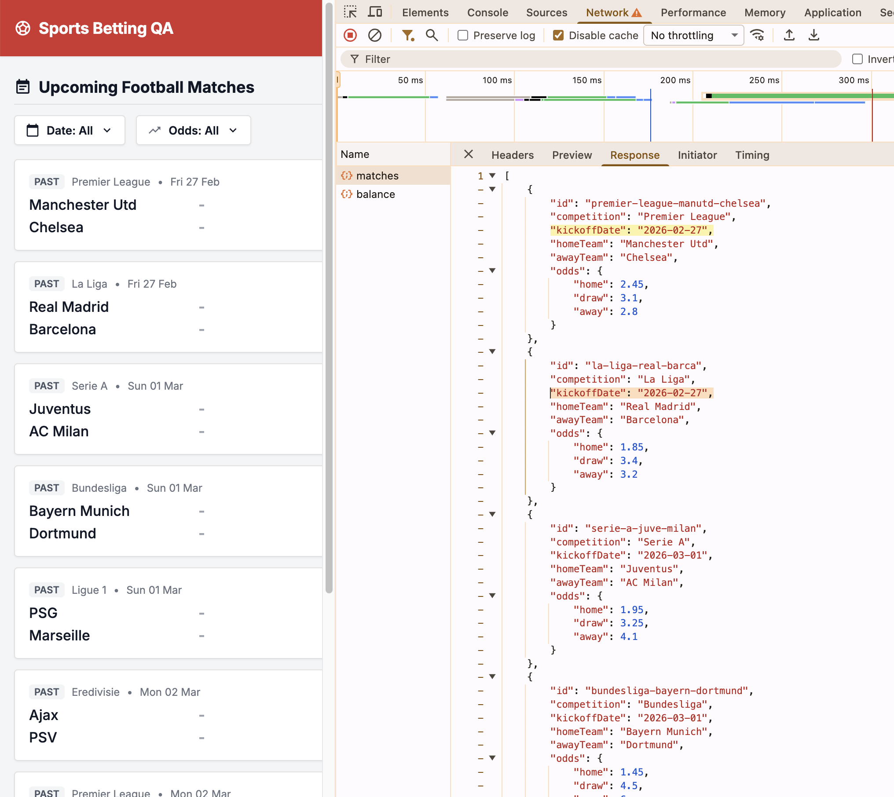

# Bug ID: UI-002 - Match List Does Not Show Kickoff Time (Only/None), Violating "date/time" Requirement

* **Severity:** High
* **Reproduction Steps:**
  1. Open the application and view the Matches List.
  2. Check whether each row exposes a kickoff **time** (and ideally timezone) alongside the date.
  3. (API side) Inspect `GET /api/matches` payload and the `kickoffDate` field definition.
* **Expected Result:**
  Per Spec Section 2.1 the Match List must render a kickoff **date/time** label for every match, so the user knows exactly when the event starts.
* **Actual Result:**
  The UI does not display a kickoff time. Root cause is shared between layers:
  * **Spec:** The specification itself mandates the contract gap - Section 5.3 `GET /api/matches` documents `kickoffDate: string (YYYY-MM-DD)` (see [SPEC-002](../specs/SPEC-002_kickoff_datetime_vs_date.md)), i.e. explicitly a **date only**, with no time component or timezone.
  * **API:** consequently `GET /api/matches` only exposes `kickoffDate` as a `YYYY-MM-DD` value (`api/models/matches.py:15`), matching that spec.
  * **UI:** the UI does not render a time even when the response is intercepted/mocked to include a full datetime.
  The user therefore sees only a date, or no time at all.
* **Business Impact:**
  Users cannot tell when a match starts; the spec requires a kickoff date/time label.
* **Evidence:**
  Screenshot below shows match rows without a kickoff time. See [SPEC-002](../specs/SPEC-002_kickoff_datetime_vs_date.md) for full contract analysis.

