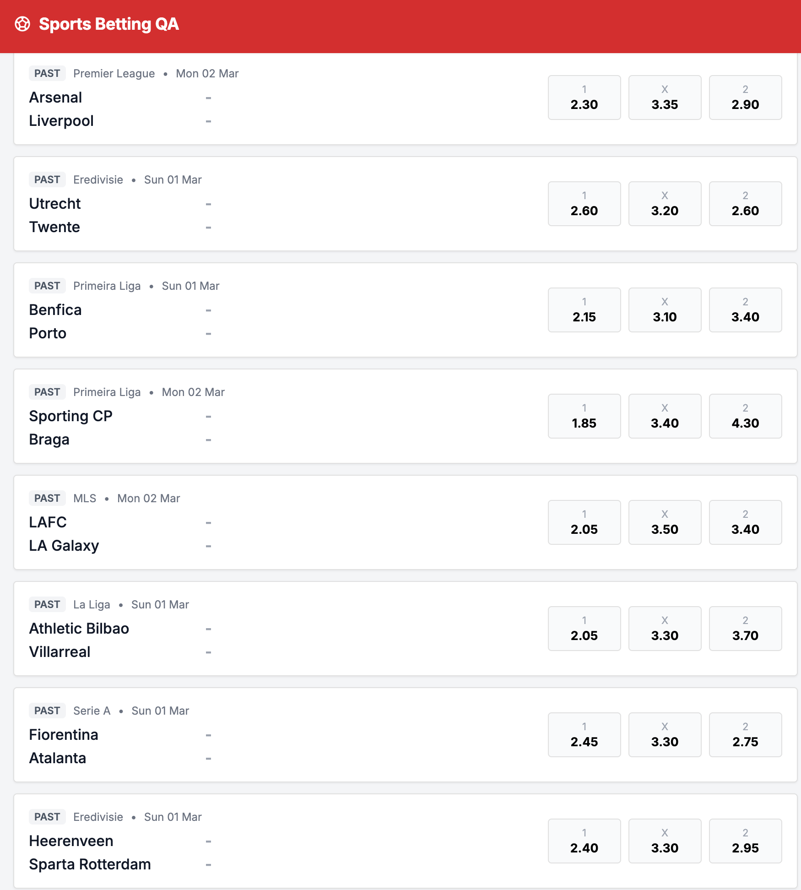

# Bug ID: UI-003 - Match List Is Not Sorted (No Deterministic Order)

* **Severity:** Low
* **Reproduction Steps:**
  1. Open the application and view the Matches List.
  2. Read the kickoff dates top-to-bottom and verify they increase (or follow any documented order).
* **Expected Result:**
  The Match List should be sorted deterministically - most naturally by kickoff datetime ascending so upcoming matches appear in chronological order. Note: the specification does **not** define any sort order for the Match List (no ordering requirement in Section 2.1), so the expected behavior is an assumption, not an explicit spec rule.
* **Actual Result:**
  Rows appear in an arbitrary/unsorted order; kickoff dates do not ascend monotonically down the list, making it hard to scan for the next event. With no sorting mandated by the spec, the UI provides no defined ordering at all.
* **Business Impact:**
  Harder to find the next match when rows are not in kickoff order.
* **Evidence:**
  Screenshot below shows match order not chronological.

