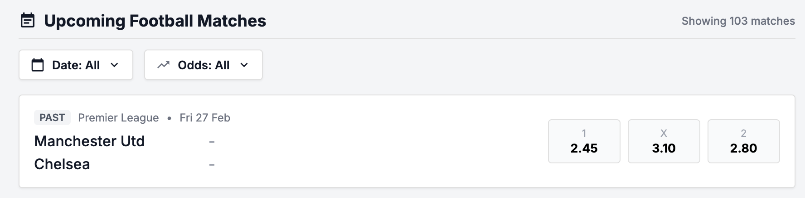
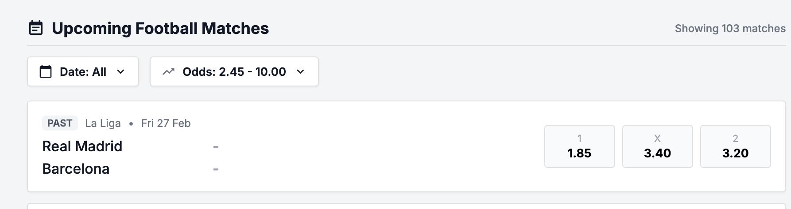

# Bug ID: UI-004 - Odds Filter "MIN" Value Is Exclusive (Should Be Inclusive)

* **Severity:** Medium
* **Reproduction Steps:**
  1. Open the Filters panel and set an odds **MIN** value equal to an odds figure that exists in the list (e.g. `1.45`).
  2. Apply the filter and inspect the visible matches.
  3. Note whether matches whose odds exactly equal the MIN are retained.
* **Expected Result:**
  Per Spec Section 2.6 the odds filter boundaries are **inclusive** - a match with odds exactly equal to the MIN must remain visible.
* **Actual Result:**
  The MIN boundary behaves **exclusively**: matches whose odds equal the entered MIN are filtered out, contradicting the documented "inclusive min/max" rule.
* **Business Impact:**
  Matches at the MIN boundary disappear, so users may think markets are missing.
* **Evidence:**
  Screenshots below demonstrate MIN boundary dropping matching odds. See [SPEC-006](../specs/SPEC-006_filters_no_api_contract.md) for the missing filter contract.

