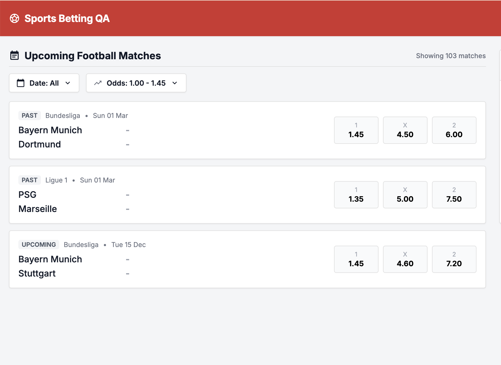

# Bug ID: UI-005 - Odds Filter "MAX" Behaviour Is Unclear (How the Limit Applies Across the 3 Odds per Match Undefined)

* **Severity:** Low
* **Reproduction Steps:**
  1. Open the Filters panel and set an odds **MAX** value between two of the three odds of a match (e.g. a match with `home=2.45, draw=3.1, away=2.8` and MAX set to `3`).
  2. Apply the filter and observe whether that match is kept or removed.
  3. Repeat with matches where only some of the three outcomes fall under MAX (e.g. `home=1.35, draw=5, away=7.5`, MAX=`4`).
* **Expected Result:**
  Per Spec Section 2.6 the odds filter is "inclusive min/max", but the spec never defines **how** the bound applies to the three-outcome market of a single match (each match exposes `odds.home`, `odds.draw`, `odds.away`). The expected semantics must be explicit: e.g. a match is kept if **at least one** of its three odds is within `[min,max]`, or only if **all three** are, or based on a specific outcome. This must be predictable and documented (see [SPEC-006](../specs/SPEC-006_filters_no_api_contract.md)).
* **Actual Result:**
  The MAX behaviour is ambiguous: when a match has three different odds, it is unclear whether the MAX limit applies to all three (keep only if every outcome ≤ MAX), to any one of them (keep if at least one outcome ≤ MAX), or to some other rule. The UI gives no feedback explaining which matches it retained/removed, and the result is not self-evident.
* **Business Impact:**
  Users cannot predict which matches will appear when a match has three different odds.
* **Evidence:**
  Screenshot below demonstrates unclear MAX filtering result. See [SPEC-006](../specs/SPEC-006_filters_no_api_contract.md) (filter contract undefined).

