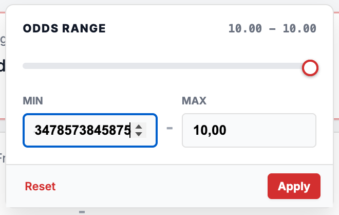
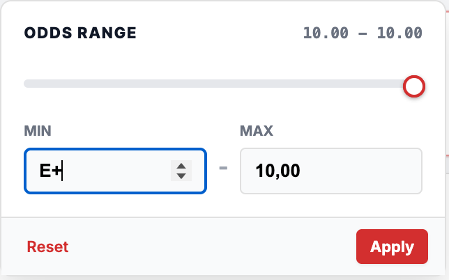

# Bug ID: UI-006 - Odds Filter Accepts Invalid Input (Extra Symbols, No Length Limit)

* **Severity:** Low
* **Reproduction Steps:**
  1. Open the Filters panel and enter non-numeric / out-of-spec characters into the odds MIN/MAX fields (e.g. `E`, `+`, letters, symbols, very long strings).
  2. Attempt to apply the filter.
  3. Observe whether the input is rejected, sanitised, or clamped.
* **Expected Result:**
  Per Spec Section 2.6 the UI must "reject invalid ranges with clear feedback". Input fields should constrain to valid numeric odds (digits, a single decimal point, bounded length) and reject unsupported symbols.
* **Actual Result:**
  The filter fields accept extra/unsupported symbols (e.g. `E`, `+`) and impose no length limit, so malformed values can be typed in. However, this did **not** affect filtering: on apply the invalid input was silently reset/cleared and the filter continued to work normally with valid values. The impact is limited to weak input validation / no clear user feedback, not to broken filtering.
* **Business Impact:**
  Invalid input is accepted with no feedback, but on apply it is silently cleared and filtering still works.
* **Evidence:**
  Screenshots below show invalid inputs in odds filter. See [SPEC-006](../specs/SPEC-006_filters_no_api_contract.md).

