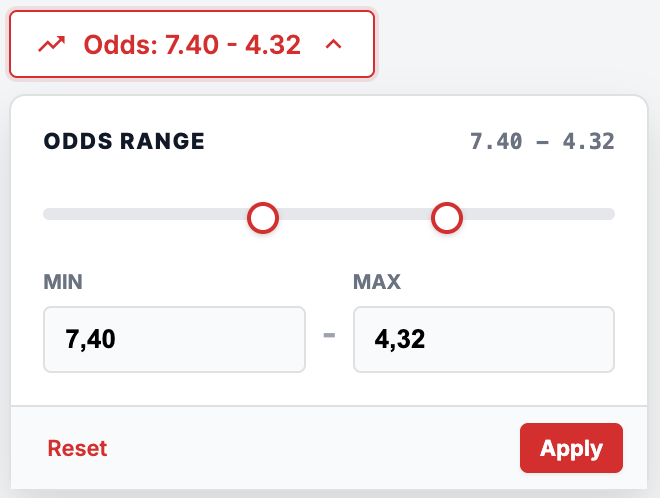

# Bug ID: UI-007 - Odds Filter Allows MIN Greater Than MAX (Invalid Range Not Rejected)

* **Severity:** Medium
* **Reproduction Steps:**
  1. Open the Filters panel.
  2. Set odds **MIN** to a value larger than odds **MAX** either by typing invalid numbers (e.g. MIN = `5`, MAX = `2`) **or** by dragging the range sliders past each other in opposite directions so MIN ends up right of MAX.
  3. Apply the filter and observe the result/feedback.
* **Expected Result:**
  Per Spec Section 2.6 the UI must reject invalid ranges (MIN > MAX) "with clear feedback" and not apply a nonsensical filter.
* **Actual Result:**
  The UI accepts an inverted range without rejecting it or showing any clear error - both when invalid numbers are typed and when the **range sliders are dragged in opposite directions so MIN passes MAX** (crossing handles, no guard). The filter is then applied (typically returning no matches or undefined behaviour) and the user receives no guidance.
* **Business Impact:**
  Users apply an invalid range and get an empty list with no explanation.
* **Evidence:**
  Screenshot below shows odds filter where MIN > MAX accepted, no error. See [SPEC-006](../specs/SPEC-006_filters_no_api_contract.md).

