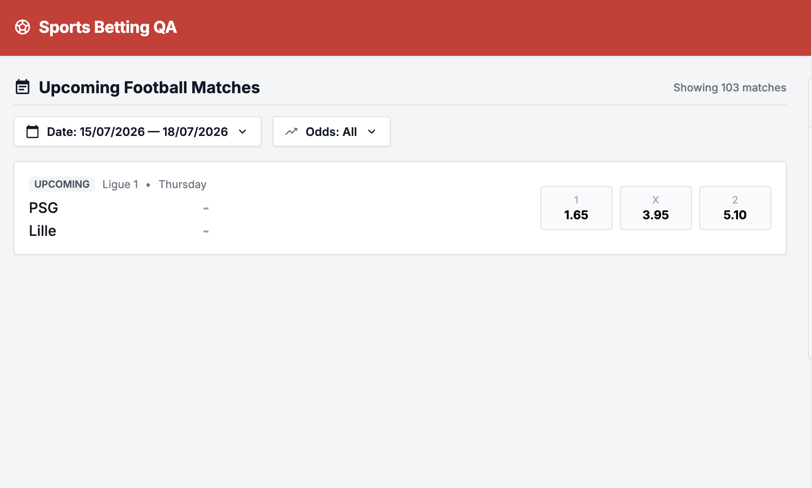

# Bug ID: UI-008 - Result Counter Always Shows Total Match Count, Ignoring Active Filter

* **Severity:** Medium
* **Reproduction Steps:**
  1. Apply an odds (or date) filter that reduces the visible match set.
  2. Observe the list counter/heading that reports the number of matches.
* **Expected Result:**
  When a filter is active, the counter should reflect the **filtered** number of matches, so the user knows how many results are currently shown.
* **Actual Result:**
  The counter continues to display the **total** number of matches regardless of the active filter, so it does not update to reflect what is actually on screen.
* **Business Impact:**
  The counter shows the total match count while the list is filtered, so the number on screen does not match what the user sees.
* **Evidence:**
  Screenshot below demonstrates counter shows all matches while filtered list is smaller.

