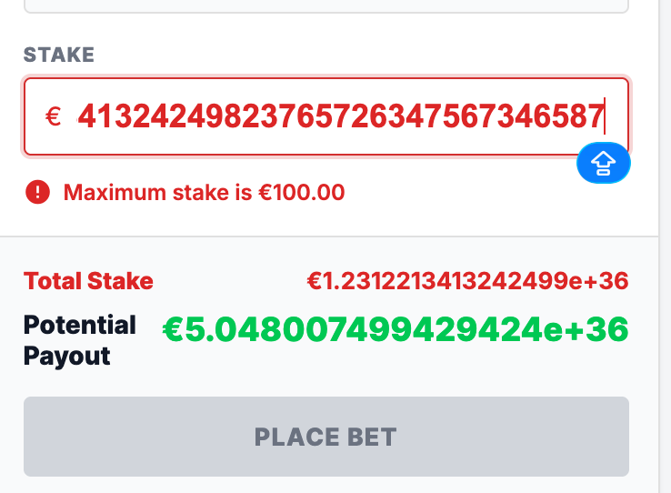

# Bug ID: UI-009 - Bet Slip Allows Stake Large Enough to Overflow "Total Stake" and "Potential Payout"

* **Severity:** Low
* **Reproduction Steps:**
  1. Add a selection to the bet slip.
  2. Enter a very large stake value (well above the documented max of €100 and/or large enough that `stake × odds` exceeds the field width/precision).
  3. Observe the "Total Stake" and "Potential Payout" fields.
* **Expected Result:**
  Per Spec Section 4.1 the stake must be validated (min €1.00 / max €100.00) and the monetary fields should render cleanly. The UI should reject out-of-range stakes and clamp/format the computed payout so it never overflows its container.
* **Actual Result:**
  The bet slip accepts an over-large stake value and the computed "Total Stake" and "Potential Payout" values overflow their fields/display, breaking layout and making the figures unreadable. Note: the **Place Bet button is disabled** for such out-of-range input, so the bet cannot be submitted manually from the UI (the backend `ge=1.0, le=100.0` in `api/models/bets.py:18` is still not enforced client-side, but the disabled button prevents the overflow from reaching placement).
* **Business Impact:**
  Overflowing fields look broken, but the Place Bet button stays disabled for out-of-range stakes, so placement is blocked from the UI.
* **Evidence:**
  Screenshot below shows stake overflowing computed fields.

