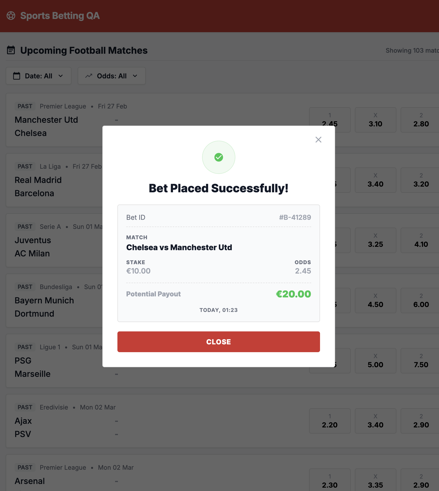

# Bug ID: UI-010 - Bet Receipt Defects (Missing Information + Wrong Home/Away Order)

* **Severity:** High
* **Reproduction Steps:**
  1. Place a valid bet and open the success receipt.
  2. Check the receipt for: match date/time, the selected outcome (1/X/2 → HOME/DRAW/AWAY), an exact placement timestamp, and the correct **Home vs Away** team order.
* **Expected Result:**
  Per Spec Section 2.4 ("Success Receipt") the receipt must show consistent, complete details - including the match info, the selection, and the exact placement timestamp (not a vague relative label) - and must display the correct Home and Away teams in their proper order.
* **Actual Result:**
  The receipt has multiple defects:
  1. **Match date/time missing** - no kickoff date/time is shown (tied to [SPEC-002](../specs/SPEC-002_kickoff_datetime_vs_date.md) / [UI-002](./UI-002_no_kickoff_time.md)).
  2. **Selection not shown** - the chosen outcome is omitted, so the user cannot tell what they bet on (see [SPEC-008](../specs/SPEC-008_selection_1x2_mapping_undocumented.md)).
  3. **Timestamp is "Today"** - the placement time is rendered as a vague relative label instead of the exact date/time.
  4. **Home/Away teams swapped** - the receipt shows the Home and Away teams in the **wrong order**, so even the teams displayed are incorrect. Combined with (2), the user neither knows *which* selection they placed nor sees the correct match teams.
* **Business Impact:**
  Users cannot verify what they bet on, when, or on which teams. In a licensed market, a bet confirmation is a required record - missing or wrong fields make it unusable for disputes. Together with [UI-012](UI-012_wrong_payout_receipt.md) (wrong payout), the receipt cannot be relied on as proof of placement.
* **Evidence:** Screenshot below shows the wrong team order, confirming the user neither knows the selection nor sees the correct Home/Away teams.
 
