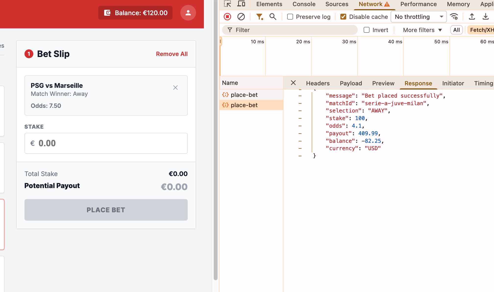

# Bug ID: UI-011 - Stale Balance After Bet Enables Overdraft (UI Does Not Refresh Balance + Backend Does Not Enforce It)

* **Severity:** Critical
* **Reproduction Steps:**
  1. Note the balance shown in the UI header before placing a bet.
  2. Place a bet and confirm success (receipt shows).
  3. Observe the header/balance display immediately afterwards.
  4. Continue placing further bets without reloading; note that the shown balance never drops.
  5. Once the real (server-side) balance is already below the next stake, place another bet anyway.
* **Expected Result:**
  Per Spec Section 4.1 the stake "Must not exceed available balance" and should be rejected/shown as insufficient balance. After placement the UI must refresh and show the updated balance returned by `POST /api/place-bet` (`balance` field in `api/models/bets.py:28`). The API should also refuse an over-balance stake (see [SPEC-004](../specs/SPEC-004_insufficient_balance_status_undefined.md) for the undefined insufficient-balance status).
* **Actual Result:**
  Two bugs combine into an overdraft:
  * **UI does not refresh the balance:** after a successful bet the UI keeps showing the **old** balance value; the new balance is never reflected.
  * **This stale balance enables further bets:** because the displayed balance never drops, the user can keep placing bets even when the real server-side balance is already insufficient. The UI sends these bets to the backend as if funds were still available.
  * **Backend does not enforce balance (API defect):** the backend accepts the stake, so the bet is placed and an **overdraft** (negative/uncovered balance) results.
* **Business Impact:**
  The operator effectively extends uncredited credit. The stale UI balance hides depletion, so the user keeps betting until [API-005](../api/API-005_overdraft_negative_balance.md) drives the ledger negative.
* **Evidence:**
  Screenshot below shows bet placed beyond available balance, balance unchanged after placement. See [SPEC-004](../specs/SPEC-004_insufficient_balance_status_undefined.md) (insufficient-balance status undefined) and [API-005](../api/API-005_overdraft_negative_balance.md) - the backend overdraft/negative-balance defect that this UI flow reaches.
 
